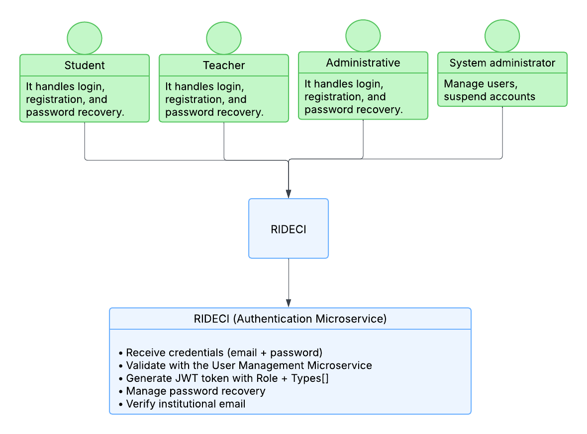

# KRATOS_AUTHENTICATION_BACKEND

## Microservicio de Autenticación - RidECI

---

## Desarrolladores

* David Santiago Palacios Pinzón
* Juan Carlos Leal Cruz
* Juan Sebastian Puentes Julio
* Sebastian Albarracin Silva
* Ana Gabriela Fiquitiva Poveda

---

## Tabla de Contenidos

* [Descripción](#descripción)
* [Características](#características)
* [Tecnologías Utilizadas](#tecnologías-utilizadas)
* [Estrategia de Versionamiento y Branching](#estrategia-de-versionamiento-y-branching)
  * [Estrategia de Ramas (Git Flow)](#estrategia-de-ramas-git-flow)
  * [Convenciones de Nomenclatura](#convenciones-de-nomenclatura)
  * [Convenciones de Commits](#convenciones-de-commits)
* [Arquitectura del Proyecto](#arquitectura-del-proyecto)
  * [Estructura de Capas](#estructura-de-capas)
  * [Flujo de una Petición](#flujo-de-una-petición)
* [Arquitectura Limpia - Organización de Capas](#arquitectura-limpia---organización-de-capas)
* [Diagramas del Módulo](#diagramas-del-módulo)
* [Instalación](#instalación)
* [Configuración](#configuración)
* [Uso](#uso)
* [API Endpoints](#api-endpoints)
* [Testing](#testing)
* [Despliegue](#despliegue)

---

## Descripción

Microservicio encargado de gestionar la **autenticación y autorización** de usuarios de la plataforma **RidECI**. Garantiza que solo miembros autorizados de la comunidad universitaria accedan al sistema mediante validación de credenciales institucionales, generación de tokens JWT seguros y control de sesiones activas.

---

## Características

### Funcionalidades Principales

- Registro con correo institucional (@escuelaing.edu.co)
- Autenticación segura con JWT
- Gestión de perfiles (Estudiante, Profesor, Empleado Administrativo)
- Verificación de conductores (licencia, placa, seguro)
- Registro de actividad de usuarios
- Recuperación de contraseña vía email institucional
- Roles de movilidad dinámicos (conductor, pasajero, acompañante)
- Actualización de datos personales desde el perfil
- Sistema de aprobación y suspensión de usuarios por administrador
- Tokens con expiración configurable para mayor seguridad
- Validación de documentos antes de habilitar publicación de viajes
- Logout y revocación de sesiones activas

---

## Tecnologías Utilizadas

| **Categoría**              | **Tecnologías**                                          |
| -------------------------- | -------------------------------------------------------- |
| **Backend**                | Java 17, Spring Boot 3.5.7, Spring Security, Maven       |
| **Base de Datos**          | MongoDB, PostgreSQL (Opcional)                           |
| **Autenticación**          | JWT, BCrypt                                              |
| **Testing**                | JUnit 5, Mockito, Testcontainers, Jacoco, SonarQube     |
| **Documentación**          | Swagger UI, Postman                                      |
| **DevOps y Deploy**        | Docker, Kubernetes (K8s), GitHub Actions, Azure, Vercel  |
| **Comunicación y Gestión** | Git/GitHub, Figma, Slack, Jira                           |

---

## Estrategia de Versionamiento y Branching

Se implementa una estrategia de versionamiento basada en **GitFlow**, garantizando un flujo de desarrollo **colaborativo, trazable y controlado**.

### Beneficios:

- Permite trabajo paralelo sin conflictos
- Mantiene versiones estables y controladas
- Facilita correcciones urgentes (*hotfixes*)
- Proporciona un historial limpio y entendible

---

## Estrategia de Ramas (Git Flow)

| **Rama**                | **Propósito**                            | **Recibe de**           | **Envía a**        | **Notas**                      |
| ----------------------- | ---------------------------------------- | ----------------------- | ------------------ | ------------------------------ |
| `main`                  | Código estable para PREPROD o Producción | `release/*`, `hotfix/*` | Despliegue         | Protegida con PR y CI exitoso  |
| `develop`               | Rama principal de desarrollo             | `feature/*`             | `release/*`        | Base para integración continua |
| `feature/*`             | Nuevas funcionalidades o refactors       | `develop`               | `develop`          | Se eliminan tras el merge      |
| `release/*`             | Preparación de versiones estables        | `develop`               | `main` y `develop` | Incluye pruebas finales        |
| `bugfix/*` o `hotfix/*` | Corrección de errores críticos           | `main`                  | `main` y `develop` | Parches urgentes               |

---

## Convenciones de Nomenclatura

### Feature Branches

```
feature/[nombre-funcionalidad]-kratos_[codigo-jira]
```

**Ejemplos:**

```
- feature/jwt-authentication-kratos_15
- feature/user-verification-kratos_28
```

**Reglas:**

* Formato: *kebab-case*
* Incluir código Jira
* Descripción breve y clara
* Longitud máxima: 50 caracteres

---

### Release Branches

```
release/[version]
```

**Ejemplos:**

```
- release/1.0.0
- release/1.1.0-beta
```

---

### Hotfix Branches

```
hotfix/[descripcion-breve-del-fix]
```

**Ejemplos:**

```
- hotfix/fix-jwt-expiration
- hotfix/email-validation-patch
```

---

## Convenciones de Commits

### Formato Estándar

```
[codigo-jira] [tipo]: [descripción breve de la acción]
```

**Ejemplos:**

```
15-feat: implementar generación de tokens JWT
28-fix: corregir validación de correo institucional
```

---

### Tipos de Commit

| **Tipo**   | **Descripción**                      | **Ejemplo**                                        |
| ----------- | ------------------------------------ | -------------------------------------------------- |
| `feat`      | Nueva funcionalidad                  | `15-feat: agregar endpoint de registro de usuario` |
| `fix`       | Corrección de errores                | `28-fix: resolver error en validación de email`    |
| `docs`      | Cambios en documentación             | `32-docs: actualizar diagrama de arquitectura`     |
| `refactor`  | Refactorización sin cambio funcional | `41-refactor: simplificar lógica de verificación`  |
| `test`      | Pruebas unitarias o de integración   | `47-test: agregar tests para JWT service`          |
| `chore`     | Mantenimiento o configuración        | `53-chore: actualizar dependencias Spring Boot`    |

**Reglas:**

* Un commit = una acción completa
* Máximo **72 caracteres** por línea
* Usar modo imperativo ("agregar", "corregir", etc.)
* Descripción clara de qué y dónde
* Commits pequeños y frecuentes

---

## Arquitectura del Proyecto

El backend de **KRATOS_AUTHENTICATION** sigue una **arquitectura limpia y desacoplada**, priorizando:

* Separación de responsabilidades
* Mantenibilidad
* Escalabilidad
* Facilidad de pruebas

---

## Estructura de Capas

```
📂 kratos_backend
 ┣ 📂 domain/
 ┃ ┣ 📄 Entities/
 ┃ ┣ 📄 ValueObjects/
 ┃ ┣ 📄 Enums/
 ┃ ┣ 📄 Repositories/ (interfaces)
 ┃ ┣ 📄 Services/
 ┃ ┗ 📄 Events/
 ┣ 📂 application/
 ┃ ┣ 📄 UseCases/
 ┃ ┣ 📄 DTOs/
 ┃ ┣ 📄 Mappers/
 ┃ ┗ 📄 Exceptions/
 ┣ 📂 infrastructure/
 ┃ ┣ 📄 API/Controllers/
 ┃ ┣ 📄 Database/
 ┃ ┣ 📄 Repositories/
 ┃ ┣ 📄 Config/
 ┃ ┣ 📄 Security/
 ┃ ┣ 📄 ExternalServices/
 ┃ ┗ 📄 ExceptionHandlers/
 ┗ 📄 pom.xml
```

---

## Flujo de una Petición

```
1. Cliente envía petición HTTP
   ↓
2. Controller (Infrastructure) - Recibe y valida
   ↓
3. Use Case (Application) - Orquesta la lógica
   ↓
4. Domain Service - Ejecuta reglas de negocio
   ↓
5. Repository Interface (Domain) - Contrato de datos
   ↓
6. Repository Implementation (Infrastructure) - Acceso a MongoDB
   ↓
7. Respuesta fluye de vuelta transformándose en cada capa
```

---

## Arquitectura Limpia - Organización de Capas

### DOMAIN (Dominio)

**Propósito:** Representa el **núcleo del negocio** y contiene los conceptos más importantes de la aplicación. Define **QUÉ** hace el sistema, no **CÓMO** lo hace.

**Contiene:**

- **Entities:** Objetos principales del negocio que representan conceptos fundamentales con sus reglas e invariantes
- **Value Objects:** Objetos inmutables que encapsulan valores con reglas específicas (ej: Email que valida formato @escuelaing.edu.co)
- **Enums:** Enumeraciones propias del dominio
- **Repositories (interfaces):** Contratos abstractos que definen operaciones de acceso a datos sin especificar implementación técnica
- **Services:** Lógica de negocio compleja que involucra múltiples entidades o procesos del dominio
- **Events:** Eventos que representan sucesos importantes dentro del dominio (ej: usuario registrado)

**Principio clave:** Esta capa NO debe depender de frameworks, bases de datos o tecnologías externas.

---

### APPLICATION (Aplicación)

**Propósito:** Encapsula la **lógica de aplicación** y define los **casos de uso** del sistema. Orquesta cómo se utiliza el dominio para resolver problemas específicos.

**Contiene:**

- **Use Cases:** Casos de uso que implementan funcionalidades completas del sistema
- **DTOs (Data Transfer Objects):** Objetos que transportan datos entre capas (RequestDTOs, ResponseDTOs)
- **Mappers:** Transformadores que convierten entre entidades del dominio y DTOs
- **Exceptions:** Excepciones personalizadas que representan errores del negocio o de la aplicación

**Ventaja principal:** Los casos de uso son independientes del framework y pueden ser reutilizados en diferentes contextos.

---

### INFRASTRUCTURE (Infraestructura)

**Propósito:** Implementa los **detalles técnicos** que permiten que el sistema funcione. Maneja aspectos de persistencia, comunicación externa, seguridad y configuración.

**Contiene:**

- **API/Controllers:** Puntos de entrada REST que exponen los endpoints HTTP
- **Database:** Configuración y modelos específicos de la base de datos (anotaciones MongoDB)
- **Repositories:** Clases que implementan las interfaces del dominio usando tecnologías específicas
- **Config:** Clases de configuración del sistema (CORS, beans de Spring, propiedades)
- **Security:** Implementación de mecanismos de seguridad (JWT, filtros de autenticación, Spring Security)
- **External Services:** Integraciones con servicios externos (SMTP, almacenamiento de archivos)
- **Exception Handlers:** Manejo centralizado de excepciones que convierte errores en respuestas HTTP

**Característica:** Esta capa SÍ depende de frameworks y tecnologías (Spring Boot, MongoDB, JWT, etc.).

---

### Beneficios de esta Arquitectura

| Característica                      | Beneficio                                                          |
| ----------------------------------- | ------------------------------------------------------------------ |
| **Independencia de Frameworks**     | El dominio no depende de Spring, MongoDB o cualquier tecnología    |
| **Testabilidad**                    | Cada capa puede probarse de forma aislada con mocks                |
| **Mantenibilidad**                  | Cambios en BD o framework no afectan la lógica de negocio          |
| **Escalabilidad**                   | Fácil agregar nuevos casos de uso sin modificar código existente   |
| **Claridad**                        | Responsabilidades bien definidas facilitan comprensión del código  |

---

## Diagramas del Módulo

### Diagrama de Contexto



**Explicación:**

El diagrama presenta el Microservicio de Autenticación como el principal enfoque del módulo de RidECI. En la parte superior están los cuatro tipos de usuarios que van a usar la plataforma: estudiantes, profesores, administrativos y el administrador del sistema. Todos ellos entran a través del sistema de RIDECI, que es básicamente la puerta de entrada para hacer login, registrarse o recuperar su contraseña.

El Microservicio de Autenticación hace el trabajo pesado del sistema. Cuando alguien intenta entrar, este microservicio recibe el email y la contraseña, se comunica con el Microservicio de Gestión de Usuarios para verificar que todo esté correcto, y si todo sale bien, genera un token JWT. Este token es especial porque incluye dos cosas importantes: el role (que dice si eres estudiante, profesor o administrativo) y el types[] (que es un array que dice si puedes ser conductor, pasajero o acompañante). También se encarga de ayudarte si olvidaste tu contraseña y de verificar que tu correo sea de verdad uno institucional de la institución.

---

### Diagrama de Clases


**Explicación:**

*[Pendiente de documentación]*

---

### Diagrama de Componentes Específico


**Explicación:**

*[Pendiente de documentación]*

---

### Diagrama de Despliegue


**Explicación:**

*[Pendiente de documentación]*

---

### Diagrama de Bases de Datos


**Explicación:**

*[Pendiente de documentación]*

---

## Instalación

### Prerrequisitos

- Java 17 o superior
- Maven 3.6+
- MongoDB 4.4+
- Git

### Clonar el repositorio

```bash
git clone https://github.com/RIDECI/KRATOS_AUTHENTICATION_BACKEND.git
cd KRATOS_AUTHENTICATION_BACKEND
```

### Instalar dependencias

```bash
mvn clean install
```

---

## Configuración

*[Sección pendiente de completar con variables de entorno, configuración de base de datos, etc.]*

---

## Uso

*[Sección pendiente de completar con instrucciones de ejecución local, desarrollo, etc.]*

---

## API Endpoints

*[Sección pendiente de completar con documentación de endpoints principales]*

---

## Testing

*[Sección pendiente de completar con instrucciones de ejecución de tests, cobertura, etc.]*

---

## Despliegue

*[Sección pendiente de completar con instrucciones de despliegue en Azure, configuración de K8s, etc.]*

---

**RidECI** - Conectando a la comunidad para moverse de forma segura, económica y sostenible.