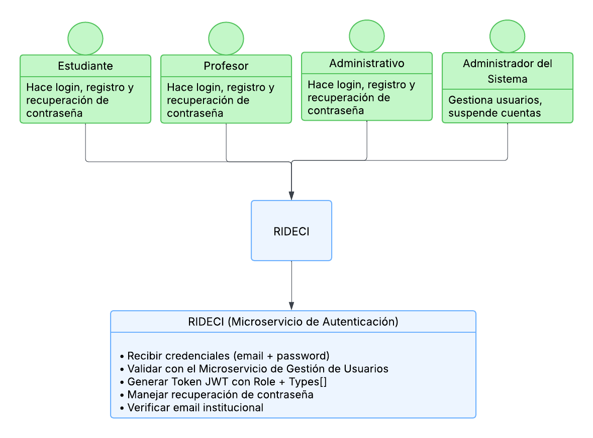

# KRATOS_AUTHENTICATION_BACKEND

## Microservicio de Autenticación - RidECI
## Integrantes
- David Santiago Palacios Pinzón
- Juan Carlos Leal Cruz
- Juan Sebastian Puentes Julio
- Sebastian Albarracin Silva
- Ana Gabriela Fiquitiva Poveda

## Descripción

Microservicio encargado de gestionar la autenticación, autorización y verificación de usuarios de la plataforma RidECI. Garantiza que solo miembros autorizados de la comunidad universitaria accedan al sistema mediante validación de credenciales institucionales.

## Tabla de Contenidos

- [Características](#características)
- [Tecnologías](#tecnologías)
- [Diagramas](#diagramas)
- [Estructura del Proyecto](#estructura-del-proyecto)
- [Instalación](#instalación)
- [Configuración](#configuración)
- [Uso](#uso)
- [API Endpoints](#api-endpoints)
- [Testing](#testing)
- [Despliegue](#despliegue)

##  Características

- Registro con correo institucional (@escuelaing.edu.co)
- Autenticación segura con JWT
- Gestión de perfiles (Estudiante, Profesor, Empleado Administrativo)
- Verificación de conductores (licencia, placa, seguro)
- Registro de actividad de usuarios
- Recuperación de contraseña vía email institucional
- Roles de movilidad dinámicos (conductor, pasajero, acompañante)
- Actualización de datos personales desde el perfil
- Sistema de aprobación y suspensión de usuarios por administrador
- Tokens con expiración configurable para mayor seguridad
- Validación de documentos antes de habilitar publicación de viajes
- Logout y revocación de sesiones activas

## Tecnologías

### Backend
- **Java 17** - Lenguaje de programación principal
- **Spring Boot 3.5.7** - Framework de aplicación
- **Spring Security** - Gestión de seguridad y autenticación
- **Maven** - Gestión de dependencias

### Base de Datos
- **MongoDB** - Base de datos NoSQL principal
- **PostgreSQL** - (Opcional) Para datos relacionales críticos

### Autenticación
- **JWT** - JSON Web Tokens para autenticación stateless
- **BCrypt** - Hashing de contraseñas

### Testing
- **JUnit 5** - Framework de testing
- **Mockito** - Mocking de dependencias
- **Testcontainers** - Tests de integración con MongoDB
- **Jacoco** - Cobertura de código
- **SonarQube** - Análisis de calidad de código

### Documentación
- **Swagger UI** - Documentación interactiva de API
- **Postman** - Colecciones de pruebas

### DevOps y Deploy
- **Docker** - Contenedorización
- **Kubernetes (K8s)** - Orquestación de contenedores
- **GitHub Actions** - CI/CD pipeline
- **Azure** - Despliegue de backend
- **Vercel** - (Frontend) Despliegue del cliente

### Herramientas de Colaboración
- **Git / GitHub** - Control de versiones
- **Figma** - Diseño de interfaces
- **Slack** - Comunicación del equipo
- **Jira** - Gestión de proyecto y sprints


## Diagramas
### Diagrama de Contexto


**Explicación:**

- El diagrama presenta el Microservicio de Autenticación como el principal enfoque del modúlo de RidECI. En la parte de arriba están los cuatro tipos de usuarios que van a usar la plataforma: estudiantes, profesores, administrativos y el administrador del sistema. Todos ellos entran a través del sistema de RIDECI, que es básicamente la puerta de entrada para hacer login, registrarse o recuperar su contraseña.

- El Microservicio de Autenticación hace el trabajo pesado del sistema. Cuando alguien intenta entrar, este microservicio recibe el email y la contraseña, se comunica con el Microservicio de Gestión de Usuarios para verificar que todo esté correcto, y si todo sale bien, genera un token JWT. Este token es especial porque incluye dos cosas importantes: el role (que dice si eres estudiante, profesor o administrativo) y el types[] (que es un array que dice si puedes ser conductor, pasajero o acompañante). También se encarga de ayudarte si olvidaste tu contraseña y de verificar que tu correo sea de verdad uno institucional de la institucón


### Diagrama de Clases


**Explicación:**

### Diagrama de Componentes Específico


**Explicación:**
### Diagrama de Despliegue


**Explicación:**
### Diagrama de Bases de Datos (Por Definir)


**Explicación:**

## Estructura del Proyecto

Este proyecto implementa **Arquitectura Limpia (Clean Architecture)**, organizando el código en capas independientes que separan la lógica de negocio de los detalles técnicos.

```
src/
├── main/
│   ├── java/edu/dosw/rideci/
│   │   ├── domain/              # CAPA DE DOMINIO
│   │   ├── application/         # CAPA DE APLICACIÓN
│   │   └── infrastructure/      # CAPA DE INFRAESTRUCTURA
│   └── resources/
└── test/
```

### Arquitectura Limpia

#### DOMAIN (Dominio)
**Propósito:** Representa el núcleo del negocio y contiene los conceptos más importantes de la aplicación. Define **QUÉ** hace el sistema, no **CÓMO** lo hace.

**Contiene:**
- **Entities:** Objetos principales del negocio que representan conceptos fundamentales con sus reglas e invariantes.
- **Value Objects:** Objetos inmutables que encapsulan valores con reglas específicas, como Email que valida el formato @escuelaing.edu.co.
- **Enums:** Enumeraciones propias del dominio .
- **Repositories (interfaces):** Contratos abstractos que definen las operaciones de acceso a datos sin especificar la implementación técnica.
- **Services:** Lógica de negocio compleja que involucra múltiples entidades o procesos del dominio (ej: validación de autenticación).
- **Events:** Eventos que representan sucesos importantes dentro del dominio (ej: usuario registrado).

**Principio clave:** Esta capa NO debe depender de frameworks, bases de datos o tecnologías externas.

---

#### APPLICATION (Aplicación)
**Propósito:** Encapsula la lógica de aplicación y define los casos de uso del sistema. Orquesta cómo se utiliza el dominio para resolver problemas específicos.

**Contiene:**
- **Use Cases:** Casos de uso que implementan funcionalidades completas del sistema. Cada caso de uso orquesta una operación de negocio completa.
- **DTOs (Data Transfer Objects):** Objetos que transportan datos entre capas, separando la representación interna del dominio de la exposición externa (RequestDTOs, ResponseDTOs).
- **Mappers:** Transformadores que convierten entre entidades del dominio y DTOs, manteniendo la separación de responsabilidades.
- **Exceptions:** Excepciones personalizadas que representan errores del negocio o de la aplicación.

**Ventaja principal:** Los casos de uso son independientes del framework y pueden ser reutilizados en diferentes contextos.

---

#### INFRASTRUCTURE (Infraestructura)
**Propósito:** Implementa los detalles técnicos que permiten que el sistema funcione. Maneja aspectos de persistencia, comunicación externa, seguridad y configuración.

**Contiene:**
- **API / Controllers:** Puntos de entrada REST que exponen los endpoints HTTP. Reciben las solicitudes del cliente, invocan los casos de uso correspondientes y devuelven respuestas.
- **Database:** Configuración y modelos específicos de la base de datos (anotaciones de MongoDB).
- **Repositories:** Clases que implementan las interfaces del dominio utilizando tecnologías específicas (MongoDB, Spring Data).
- **Config:** Clases de configuración del sistema (CORS, beans de Spring, propiedades de aplicación, configuración de seguridad).
- **Security:** Implementación de mecanismos de seguridad (generación/validación JWT, filtros de autenticación, configuración de Spring Security).
- **External Services:** Integraciones con servicios externos (envío de emails vía SMTP, almacenamiento de archivos).
- **Exception Handlers:** Manejo centralizado de excepciones que convierte errores en respuestas HTTP apropiadas.

**Característica:** Esta capa SÍ depende de frameworks y tecnologías (Spring Boot, MongoDB, JWT, etc.).

###  Flujo de una Petición

```
1. Cliente envía petición HTTP
   ↓
2. Controller (Infrastructure) - Recibe y valida
   ↓
3. Use Case (Application) - Orquesta la lógica
   ↓
4. Domain Service - Ejecuta reglas de negocio
   ↓
5. Repository Interface (Domain) - Contrato de datos
   ↓
6. Repository Implementation (Infrastructure) - Acceso a MongoDB
   ↓
7. Respuesta fluye de vuelta transformándose en cada capa
```

### Beneficios de esta Arquitectura

| Característica | Beneficio |
|----------------|-----------|
| **Independencia de Frameworks** | El dominio no depende de Spring, MongoDB o cualquier tecnología específica |
| **Testabilidad** | Cada capa puede probarse de forma aislada con mocks |
| **Mantenibilidad** | Cambios en la BD o framework no afectan la lógica de negocio |
| **Escalabilidad** | Fácil agregar nuevos casos de uso sin modificar código existente |
| **Claridad** | Responsabilidades bien definidas facilitan la comprensión del código |

## Instalación

### Clonar el repositorio
```bash
git clone https://github.com/RIDECI/KRATOS_AUTHENTICATION_BACKEND.git
cd KRATOS_AUTHENTICATION_BACKEND
```

### Instalar dependencias
```bash
mvn clean install
```
